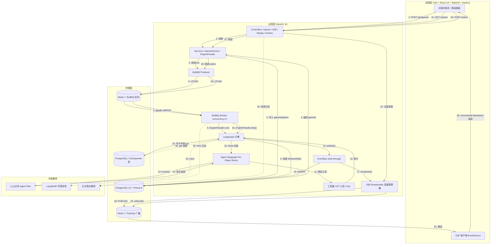
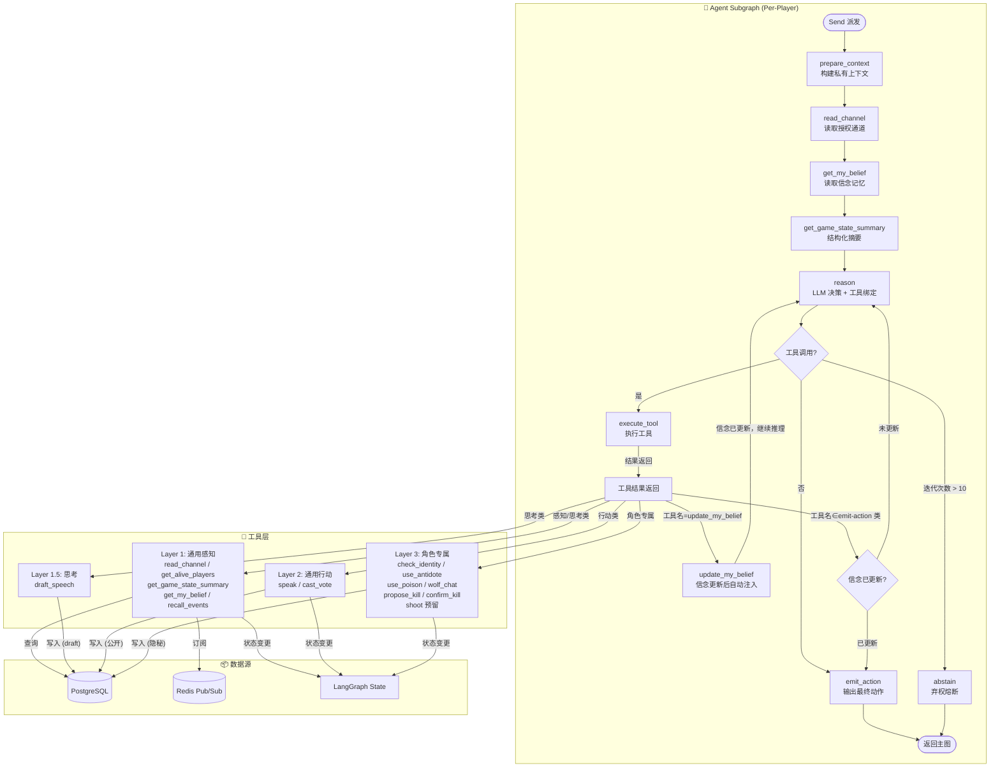
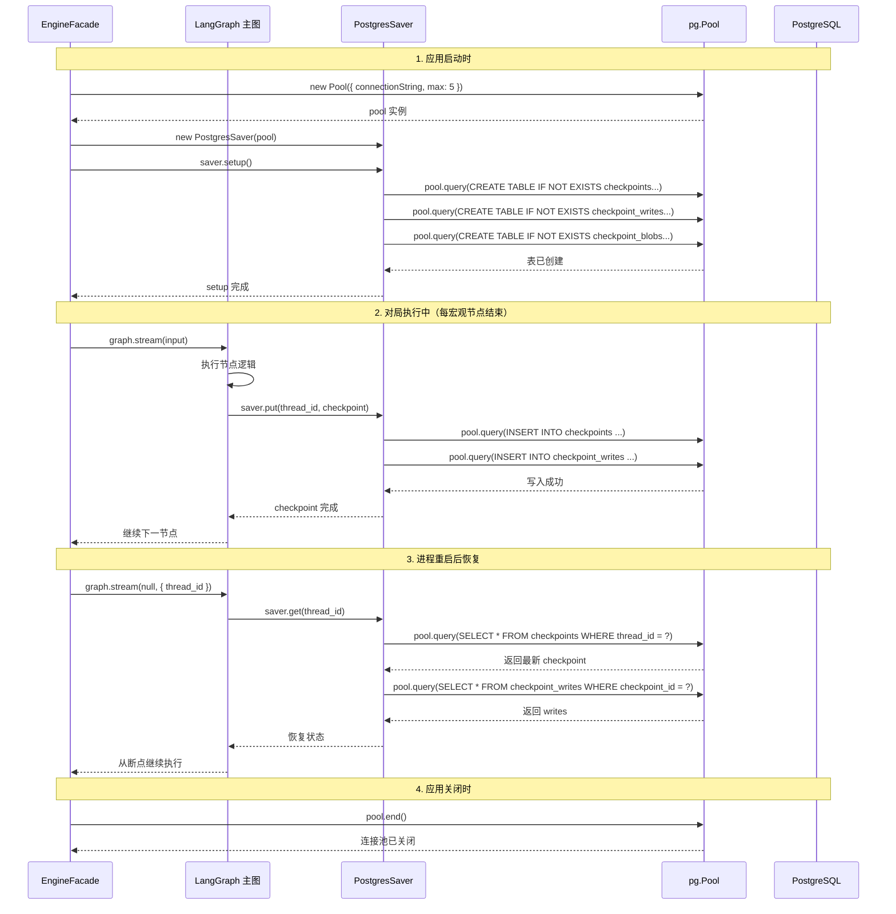
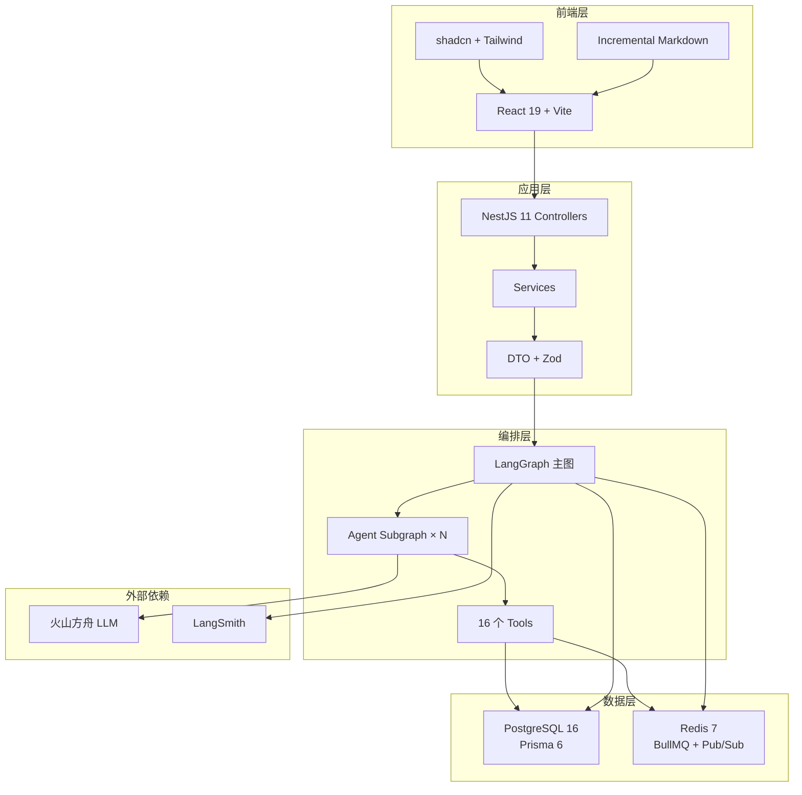

# 狼人杀流程图

## 业务流程图

```mermaid
flowchart TD
    %% ========== 节点定义区域 ==========
    Start([开始])
    Init[初始化对局]
    InitDetail1[随机分配12个座次]
    InitDetail2[按Ruleset随机分配角色]
    InitDetail3[每个Agent初始化独立记忆]
    InitDetail4[狼队花名册注入Wolf Channel]
    InitDetail5[配置生效: Ruleset/板子类型/特殊规则]
    NightEntry{{进入黑夜}}
    NightStart[夜间开始]

    NightLoopStart{遍历Ruleset.nightPhaseOrder}
    GuardExist{板子有守卫?}
    SkipGuard[跳过守卫阶段]
    GuardPhase[守卫选择守护目标]
    GuardDetail[记录连守禁令]

    WolfExist{板子有狼人?}
    SkipWolf[跳过狼人阶段]
    WolfPhase[狼队频道讨论]
    WolfDetail[共识选择刀人目标]

    SeerExist{板子有预言家?}
    SkipSeer[跳过预言家阶段]
    SeerPhase[预言家选择查验目标]
    SeerDetail[系统私信返回结果]

    WitchExist{板子有女巫?}
    SkipWitch[跳过女巫阶段]
    WitchPhase[女巫收到死讯]
    WitchDetail[决定是否使用解药/毒药<br>一晚只能用一瓶]

    BearExist{板子有熊?}
    SkipBear[跳过熊阶段]
    BearPhase[熊嗅探左右邻座]
    BearDetail[有狼则咆哮]

    OtherExist{板子有其他角色?}
    SkipOther[跳过其他阶段]
    OtherPhase[扩展角色行动]
    OtherDetail[石像鬼/天狗/咒狐等]

    NightResolve[结算夜晚行动]
    NightResolveDetail[按执行顺序结算<br>守卫守护抵消刀人<br>女巫解药抵消刀人<br>毒药生效]
    PlayerDied{有玩家死亡?}
    NightSpecialCheck{触发夜间特殊规则?}
    GargoyleTransform[石像鬼变狼阵营]

    DayEntry{{进入白天}}
    DayStart[天亮公布死讯]
    DayStartDetail[公布: 昨晚谁死亡<br>公布: 是否有熊咆哮]
    SpeechPhase[发言阶段]
    SpeechOrder{按Ruleset.speakingOrder}
    OrderByDeath[从死者下家开始]
    OrderBySeat[按座次升序]
    OrderRandom[随机顺序]
    OrderSheriff[警长决定发言顺序]

    BuildContext[构建Agent私人上下文]
    ContextDetail[组合: 公共历史+角色技能反馈+狼队频道]
    GenerateSpeech[Agent生成发言]
    SpeechCheck{发言合规校验}
    SpeechFallback[系统自动生成合规发言/跳过]
    Publish[发言写入Public Channel]

    VotePhase[投票阶段]
    VoteDetail[所有存活玩家投票<br>Agent独立决策]
    VoteCheck{投票目标是否合法?}
    VoteFallback[默认弃票或随机存活目标]
    VoteSubmit[写入Votes表]
    VoteResult[计票]

    VoteResultCheck{最高票情况}
    TieBreak{平票处理}
    TieBreakDetail[按规则处理<br>如: 无人被放逐/两人PK]
    Execute[执行放逐]
    NoExecution[无人被放逐]
    ExecuteDetail[被放逐玩家死亡]
    DaySpecialCheck{触发白天特殊规则?}
    HunterShoot[猎人开枪]
    WolfKingShoot[狼王开枪]
    IdiotFlip[白痴翻牌]

    CheckWin{{胜负判定}}
    CheckWinDetail[按Ruleset.winConditions顺序求值]
    WinCondition1{wolf_alive >= good_alive?}
    WinCondition2{wolf_alive == 0?}
    WinCondition3{其他胜利条件?}
    WolfWin[狼人阵营胜利]
    GoodWin[好人阵营胜利]
    OtherWin[其他阵营胜利]

    GameEnd([游戏结束])
    GameEndDetail[记录对局结果<br>更新对局统计<br>清理运行时状态]

    %% ========== 连接关系区域 ==========
    Start --> Init
    Init --> InitDetail1
    InitDetail1 --> InitDetail2
    InitDetail2 --> InitDetail3
    InitDetail3 --> InitDetail4
    InitDetail4 --> InitDetail5
    InitDetail5 --> NightEntry

    NightEntry --> NightStart
    NightStart --> NightLoopStart

    NightLoopStart -->|Phase 1: Guard| GuardExist
    GuardExist -->|否| SkipGuard
    GuardExist -->|是| GuardPhase
    GuardPhase --> GuardDetail
    SkipGuard --> NightLoopStart
    GuardDetail --> NightLoopStart

    NightLoopStart -->|Phase 2: Wolf| WolfExist
    WolfExist -->|否| SkipWolf
    WolfExist -->|是| WolfPhase
    WolfPhase --> WolfDetail
    SkipWolf --> NightLoopStart
    WolfDetail --> NightLoopStart

    NightLoopStart -->|Phase 3: Seer| SeerExist
    SeerExist -->|否| SkipSeer
    SeerExist -->|是| SeerPhase
    SeerPhase --> SeerDetail
    SkipSeer --> NightLoopStart
    SeerDetail --> NightLoopStart

    NightLoopStart -->|Phase 4: Witch| WitchExist
    WitchExist -->|否| SkipWitch
    WitchExist -->|是| WitchPhase
    WitchPhase --> WitchDetail
    SkipWitch --> NightLoopStart
    WitchDetail --> NightLoopStart

    NightLoopStart -->|Phase 5: Bear| BearExist
    BearExist -->|否| SkipBear
    BearExist -->|是| BearPhase
    BearPhase --> BearDetail
    SkipBear --> NightLoopStart
    BearDetail --> NightLoopStart

    NightLoopStart -->|Phase N: Other| OtherExist
    OtherExist -->|否| SkipOther
    OtherExist -->|是| OtherPhase
    OtherPhase --> OtherDetail
    SkipOther --> NightLoopStart
    OtherDetail --> NightLoopStart

    NightLoopStart -->|所有阶段遍历完毕| NightResolve

    NightResolve --> NightResolveDetail
    NightResolveDetail --> PlayerDied

    PlayerDied -->|是| NightSpecialCheck
    NightSpecialCheck -->|石像鬼死亡| GargoyleTransform
    NightSpecialCheck -->|无| DayEntry
    GargoyleTransform --> DayEntry

    PlayerDied -->|否| DayEntry

    DayEntry --> DayStart
    DayStart --> DayStartDetail
    DayStartDetail --> SpeechPhase

    SpeechPhase --> SpeechOrder
    SpeechOrder -->|first_death| OrderByDeath
    SpeechOrder -->|seat_asc| OrderBySeat
    SpeechOrder -->|random| OrderRandom
    SpeechOrder -->|警长| OrderSheriff

    OrderByDeath --> BuildContext
    OrderBySeat --> BuildContext
    OrderRandom --> BuildContext
    OrderSheriff --> BuildContext

    BuildContext --> ContextDetail
    ContextDetail --> GenerateSpeech
    GenerateSpeech --> SpeechCheck
    SpeechCheck -->|格式错误/超时| SpeechFallback
    SpeechCheck -->|通过| Publish
    SpeechFallback --> Publish
    Publish --> VotePhase

    VotePhase --> VoteDetail
    VoteDetail --> VoteCheck
    VoteCheck -->|否/超时| VoteFallback
    VoteCheck -->|是| VoteSubmit
    VoteFallback --> VoteSubmit
    VoteSubmit --> VoteResult

    VoteResult --> VoteResultCheck
    VoteResultCheck -->|唯一最高票| Execute
    VoteResultCheck -->|平票| TieBreak
    VoteResultCheck -->|无人投票| NoExecution

    TieBreak --> TieBreakDetail
    TieBreakDetail --> CheckWin

    Execute --> ExecuteDetail
    ExecuteDetail --> DaySpecialCheck
    DaySpecialCheck -->|猎人被放逐| HunterShoot
    DaySpecialCheck -->|狼王被放逐| WolfKingShoot
    DaySpecialCheck -->|白痴被放逐| IdiotFlip
    DaySpecialCheck -->|无| CheckWin
    HunterShoot --> CheckWin
    WolfKingShoot --> CheckWin
    IdiotFlip --> CheckWin

    NoExecution --> CheckWin

    CheckWin --> CheckWinDetail
    CheckWinDetail --> WinCondition1
    WinCondition1 -->|是| WolfWin
    WinCondition1 -->|否| WinCondition2
    WinCondition2 -->|是| GoodWin
    WinCondition2 -->|否| WinCondition3
    WinCondition3 -->|是| OtherWin
    WinCondition3 -->|否| NightEntry

    WolfWin --> GameEnd
    GoodWin --> GameEnd
    OtherWin --> GameEnd

    GameEnd --> GameEndDetail
```

## 主架构图

```mermaid
flowchart TD
    subgraph Frontend["前端层 (Vite + React 19 + Tailwind + shadcn)"]
        Page[对局列表页 / 观战面板]
        SSE[SSE 客户端 EventSource]
    end

    subgraph Backend["应用层 (NestJS 11)"]
        Controller[Controllers: Games / SSE / Replay / Actions]
        Service[Services: GamesService / EngineFacade]
        Producer[BullMQ Producer]
        Worker[BullMQ Worker concurrency=1]
        EngineCore[LangGraph 引擎]
        Agent[Agent Subgraph Per-Player ReAct]
        Tools[工具集 16个工具 / Zod]
        EventBus[EventBus write-through]
        Broadcaster[SSE Broadcaster 连接管理器]
    end

    subgraph Storage["存储层"]
        PG[(PostgreSQL 16 + Prisma 6)]
        RedisBull[(Redis 7: BullMQ 队列)]
        RedisPubSub[(Redis 7: Pub/Sub 广播)]
        Checkpointer[(PostgreSQL: Checkpointer 表)]
    end

    subgraph External["外部服务"]
        LLM[火山方舟 Agent Plan]
        LangSmith[LangSmith 可观测性]
        LogAggregator[日志聚合服务]
    end

    %% 路径1: 创建对局
    Page -->|"1. POST /api/games"| Controller
    Controller -->|"2. 调用"| Service
    Service -->|"3. 写入 games/players"| PG
    PG -->|"4. 返回 gameId"| Service
    Service -->|"5. 投递 job"| Producer
    Producer -->|"6. LPUSH"| RedisBull

    %% 路径2: 执行对局
    RedisBull -->|"7. BRPOP"| Worker
    Worker -->|"8. EngineFacade.run()"| EngineCore
    EngineCore -->|"9. 读取 Ruleset/State"| PG
    EngineCore -->|"10. Send 派发"| Agent
    Agent -->|"11. 绑定工具"| Tools
    Tools -->|"12. 执行"| EngineCore

    %% 路径3: LLM 调用
    Agent -->|"13. invoke()"| LLM
    LLM -->|"14. 流式返回"| Agent

    %% 路径4: 事件持久化 + 广播
    EngineCore -->|"15. publish()"| EventBus
    EventBus -->|"16. INSERT"| PG
    EventBus -->|"17. broadcast()"| Broadcaster
    Broadcaster -->|"18. PUBLISH"| RedisPubSub

    %% 路径5: Checkpointer
    EngineCore -->|"19. 节点结束 put"| Checkpointer
    Checkpointer -.->|"20. get 读取"| EngineCore

    %% 路径6: 前端实时推送
    Page -->|"21. GET /stream"| Controller
    Controller -->|"22. 注册连接"| Broadcaster
    Broadcaster -->|"23. subscribe"| RedisPubSub
    RedisPubSub -->|"24. 推送"| SSE
    SSE -->|"25. Incremental Markdown 渲染"| Page

    %% 路径7: 玩家操作
    Page -->|"26. POST /action"| Controller
    Controller -->|"27. 校验"| Service
    Service -->|"28. 投递 action"| Producer
    Producer -->|"29. LPUSH"| RedisBull
    RedisBull -->|"30. BRPOP"| Worker
    Worker -->|"31. EngineFacade.step()"| EngineCore

    %% 路径8: 可观测性
    EngineCore -.->|"32. trace"| LangSmith
    Worker -.->|"33. Pino 日志"| LogAggregator
    Controller -.->|"34. 请求日志"| LogAggregator
```

## Agent Subgraph 内部数据流

```mermaid
flowchart TD
    subgraph AgentSubgraph["🧠 Agent Subgraph (Per-Player)"]
        Start([Send 派发])
        Prepare[prepare_context<br>构建私有上下文]
        ReadChannel[read_channel<br>读取授权通道]
        GetBelief[get_my_belief<br>读取信念记忆]
        GetSummary[get_game_state_summary<br>结构化摘要]

        Reason[reason<br>LLM 决策 + 工具绑定]

        ToolCall{工具调用?}
        ExecuteTool[execute_tool<br>执行工具]
        ToolResult[工具结果返回]

        UpdateBelief[update_my_belief<br>信念更新后自动注入]
        EnforceBelief{信念已更新?}

        EmitAction[emit_action<br>输出最终动作]
        Abstain[abstain<br>弃权熔断]

        End([返回主图])
    end

    subgraph ToolLayers["🔧 工具层"]
        Layer1[Layer 1: 通用感知<br>read_channel / get_alive_players<br>get_game_state_summary<br>get_my_belief / recall_events]
        Layer1_5[Layer 1.5: 思考<br>draft_speech]
        Layer2[Layer 2: 通用行动<br>speak / cast_vote]
        Layer3[Layer 3: 角色专属<br>check_identity / use_antidote<br>use_poison / wolf_chat<br>propose_kill / confirm_kill<br>shoot 预留]
    end

    subgraph DataSources["📦 数据源"]
        PG[(PostgreSQL)]
        Redis[(Redis Pub/Sub)]
        State[LangGraph State]
    end

    Start --> Prepare
    Prepare --> ReadChannel
    ReadChannel --> GetBelief
    GetBelief --> GetSummary
    GetSummary --> Reason

    Reason --> ToolCall
    ToolCall -->|是| ExecuteTool
    ToolCall -->|否| EmitAction

    ExecuteTool -->|结果返回| ToolResult
    ToolResult -->|"感知/思考类"| Layer1
    ToolResult -->|"思考类"| Layer1_5
    ToolResult -->|"行动类"| Layer2
    ToolResult -->|"角色专属"| Layer3

    Layer1 -->|查询| PG
    Layer1 -->|订阅| Redis
    Layer1_5 -->|"写入 (draft)"| PG
    Layer2 -->|"写入 (公开)"| PG
    Layer3 -->|"写入 (隐秘)"| PG

    Layer1 -->|状态变更| State
    Layer2 -->|状态变更| State
    Layer3 -->|状态变更| State

    ToolResult -->|"工具名=update_my_belief"| UpdateBelief
    UpdateBelief -->|"信念已更新，继续推理"| Reason

    ToolResult -->|"工具名∈emit-action 类"| EnforceBelief
    EnforceBelief -->|已更新| EmitAction
    EnforceBelief -->|未更新| Reason

    ToolCall -->|迭代次数 > 10| Abstain

    EmitAction --> End
    Abstain --> End
```

## Checkpointer 详细交互时序

```mermaid
sequenceDiagram
    participant Engine as EngineFacade
    participant Graph as LangGraph 主图
    participant Saver as PostgresSaver
    participant Pool as pg.Pool
    participant PG as PostgreSQL

    Note over Engine,PG: 1. 应用启动时
    Engine->>Pool: new Pool({ connectionString, max: 5 })
    Pool-->>Engine: pool 实例
    Engine->>Saver: new PostgresSaver(pool)
    Engine->>Saver: saver.setup()
    Saver->>Pool: pool.query(CREATE TABLE IF NOT EXISTS checkpoints...)
    Saver->>Pool: pool.query(CREATE TABLE IF NOT EXISTS checkpoint_writes...)
    Saver->>Pool: pool.query(CREATE TABLE IF NOT EXISTS checkpoint_blobs...)
    Pool-->>Saver: 表已创建
    Saver-->>Engine: setup 完成

    Note over Engine,PG: 2. 对局执行中（每宏观节点结束）
    Engine->>Graph: graph.stream(input)
    Graph->>Graph: 执行节点逻辑
    Graph->>Saver: saver.put(thread_id, checkpoint)
    Saver->>Pool: pool.query(INSERT INTO checkpoints ...)
    Saver->>Pool: pool.query(INSERT INTO checkpoint_writes ...)
    Pool-->>Saver: 写入成功
    Saver-->>Graph: checkpoint 完成
    Graph-->>Engine: 继续下一节点

    Note over Engine,PG: 3. 进程重启后恢复
    Engine->>Graph: graph.stream(null, { thread_id })
    Graph->>Saver: saver.get(thread_id)
    Saver->>Pool: pool.query(SELECT * FROM checkpoints WHERE thread_id = ?)
    Pool-->>Saver: 返回最新 checkpoint
    Saver->>Pool: pool.query(SELECT * FROM checkpoint_writes WHERE checkpoint_id = ?)
    Pool-->>Saver: 返回 writes
    Saver-->>Graph: 恢复状态
    Graph-->>Engine: 从断点继续执行

    Note over Engine,PG: 4. 应用关闭时
    Engine->>Pool: pool.end()
    Pool-->>Engine: 连接池已关闭
```

## 技术架构分层图（简化版）

```mermaid
flowchart TD
    subgraph L1["前端层"]
        A1[React 19 + Vite]
        A2[shadcn + Tailwind]
        A3[Incremental Markdown]
    end

    subgraph L2["应用层"]
        B1[NestJS 11 Controllers]
        B2[Services]
        B3[DTO + Zod]
    end

    subgraph L3["编排层"]
        C1[LangGraph 主图]
        C2[Agent Subgraph × N]
        C3[16 个 Tools]
    end

    subgraph L4["数据层"]
        D1[PostgreSQL 16<br>Prisma 6]
        D2[Redis 7<br>BullMQ + Pub/Sub]
    end

    subgraph L5["外部依赖"]
        E1[火山方舟 LLM]
        E2[LangSmith]
    end

    A1 --> B1
    A2 --> A1
    A3 --> A1

    B1 --> B2
    B2 --> B3
    B3 --> C1

    C1 --> C2
    C2 --> C3
    C3 --> D1
    C3 --> D2
    C1 --> D1
    C1 --> D2

    C2 --> E1
    C1 --> E2
```
